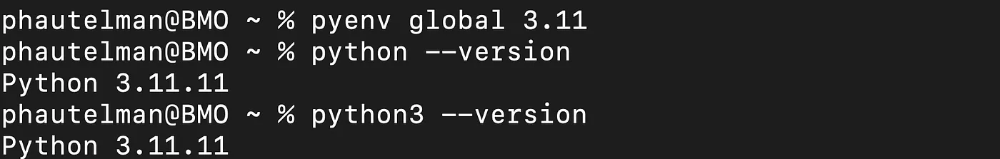
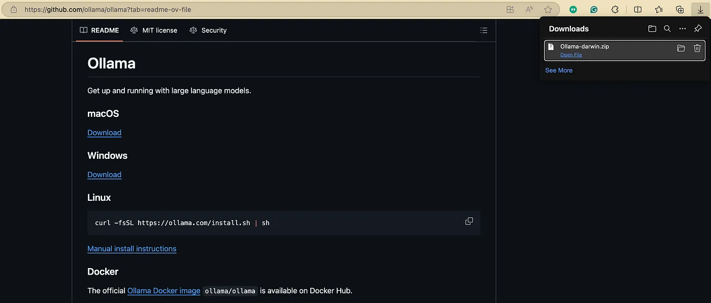
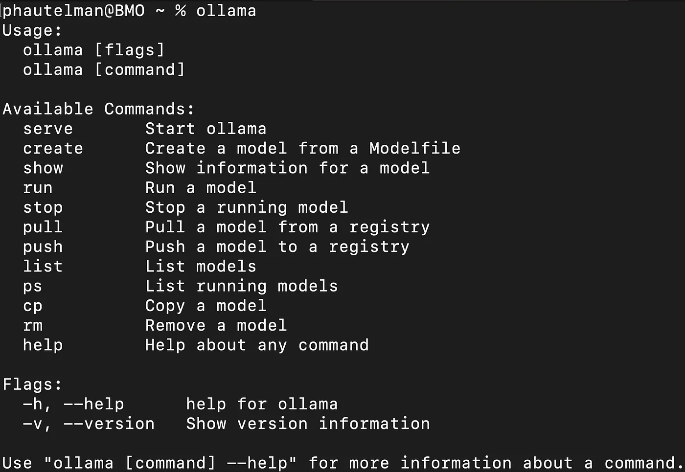
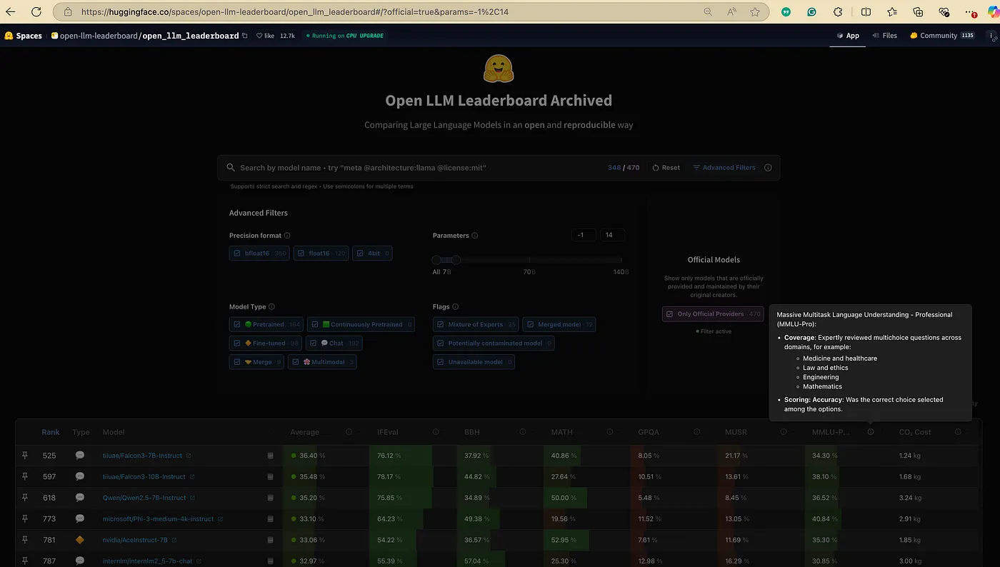
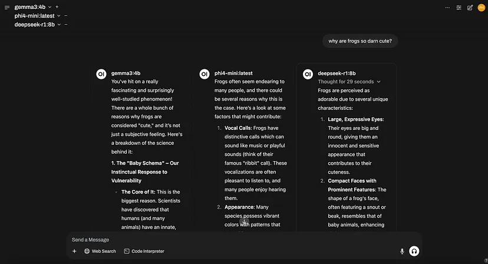
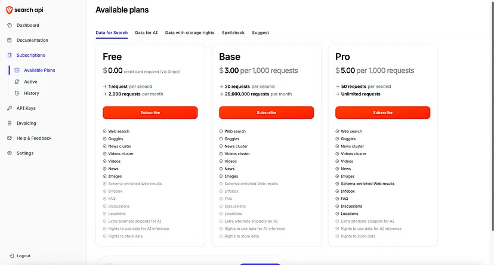
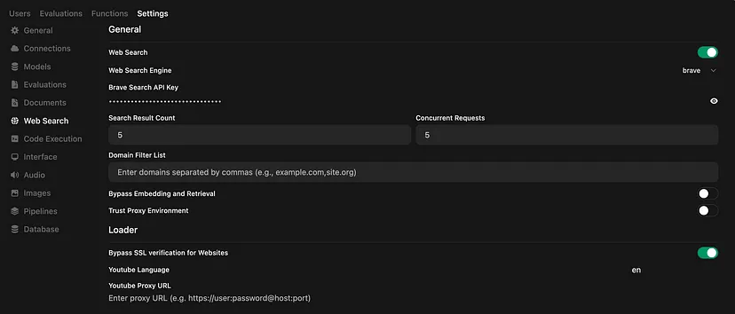
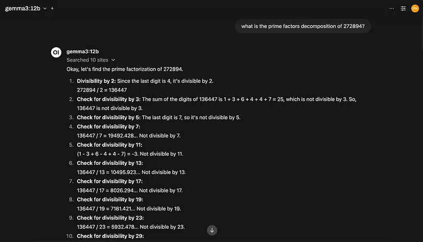
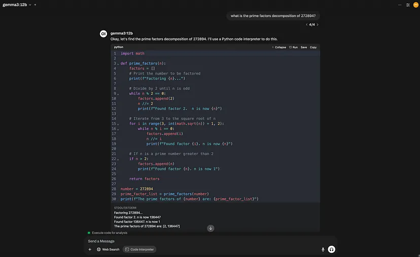

# Build Your Local AI: From Zero to a Custom ChatGPT Interface with Ollama & Open WebUI


Imagine having ChatGPT or DeepSeek-like capabilities right on your computer — no subscription fees, no privacy concerns, no waiting for responses, and complete customization options. Sounds too good to be true? **It’s not!**

Large Language Models (LLMs) have become indispensable tools for many of us. Whether you’re using them to process text, learn new concepts, generate code solutions, automate workflows, or enjoy chatting with your computer buddy — they’re changing how we work and create.

But there’s a catch with popular services like OpenAI, Anthropic, or Perplexity: they often come with limitations:

* **Cost**: Monthly subscriptions or per-token pricing can add up quickly 
* **Limited APIs**: Restricted customization options 
* **Missing features**: Many don’t offer RAG (Retrieval-Augmented Generation) capabilities 
* **Privacy concerns**: Your data might be used for training or stored on third-party servers 
* **Response delays**: Peak usage times can mean long waits for responses 

**The solution?** A locally running LLM instance that you can fully customize to your specific needs — complete with a user-friendly interface that rivals commercial offerings.

**In this guide (about a 1-hour setup)**, I’ll walk you through setting up a robust local AI environment using free, open-source tools that provide:

* Total privacy (your data stays on your machine)
* No subscription costs
* Minimal response waiting time
* Nearly comparable results to high-end commercial LLMs
* Complete customizability for your specific use cases

> *Personal note: I've been using this setup for two months, and it has cut my monthly AI subscription costs to zero while increasing my productivity. The initial setup time is worth every minute for the long-term benefits.*


## Toolstack Overview
Our local AI setup will use two primary tools:

### Ollama
[Ollama](https://github.com/ollama/ollama) is an open-source framework designed specifically for running LLMs locally. It provides:

* Access to a wide variety of open-source models (DeepSeek, Llama, Phi, Mistral, Gemma, and many more)
* Text generation capabilities
* Multimodal support (for models that can process images)
* Efficient model management


### OpenWebUI
[OpenWebUI](https://github.com/open-webui/open-webui) is currently the most prominent open-source project offering a UI interface for your Ollama instance. Think of it as your local version of the ChatGPT or Claude interface, but with even more features:

* User-friendly chat interface
* Model customization
* RAG capabilities
* Web search integration
* Code interpreter
* Complex workflow design
* And many more features are being actively developed

The best part? OpenWebUI is constantly improving as passionate engineers contribute to this open-source project, bringing features from proprietary platforms to this free alternative.

### Requirements
Before we start, make sure your system meets these minimum requirements:

* A GPU-powered laptop or desktop (minimum 4GB GPU memory, 8GB+ recommended)
* At least 20GB of free disk space (models can be large)
* A modern web browser

> ***Pro tip:** While CPU-only setups technically work, they’ll be significantly slower. Even a modest GPU will greatly improve your experience.*


## Environment Setup
### Setting Up Python 3.11
Ollama and OpenWebUI work best with Python 3.11, so we’ll start by making sure we have the correct version installed.

First, check your current Python version:

```unix
python --version
```


*If you don’t have Python 3.11*, we’ll install it using [pyenv](https://github.com/pyenv/pyenv), an excellent tool for managing multiple Python versions:

> ***Note**: Visit the [pyenv GitHub repository](https://github.com/pyenv/pyenv) for detailed installation instructions specific to your OS.*
  

#### For macOS users:

**1. Install pyenv**

```unix
brew update
brew install pyenv
```

**2. Configure your shell**
Add these lines to your shell configuration file (`.bashrc`, `.zshrc`, or equivalent):

```unix
export PYENV_ROOT="$HOME/.pyenv"
export PATH="$PYENV_ROOT/bin:$PATH"
eval "$(pyenv init --path)"
eval "$(pyenv init -)"
```

Then reload your shell:

```unix
exec "$SHELL"
```

**3. Install Python 3.11**

```unix
pyenv install 3.11
```

**4. Set it as your global Python version**

This step is optional but is recommended for quickly starting Ollama and Open WebUI from your terminal in future sessions.

```unix
pyenv global 3.11
```

**5. Verify the installation**

```unix
python --version
```

You should see an output confirming Python 3.11.8 is now installed.




## Installing and Configuring Ollama
Now that we have our Python environment ready let’s install [Ollama](https://github.com/ollama/ollama):

**1. Download and Install Ollama**

> ***Note:** Visit the Ollama GitHub page and follow the installation instructions for your OS.*

*For macOS users*, download the .zip package from the Ollama official repository, unzip the file and install it by clicking the ‘Ollama’ application file.



**2. Verify Ollama Installation**

Open a terminal/command prompt and type:

```unix
ollama
```

You should see Ollama startup with a help message indicating it’s running.



**3. Exploring Available Models**

Ollama gives you access to many open-source models. You can browse available models at [ollama.com/search](https://ollama.com/search).

When selecting a model, consider:

* **Model size** (smaller models run faster but may be less capable)
* **Specialization** (some models excel at coding, others at creative writing)
* **Memory requirements** (larger models need more GPU memory)

Check the [HuggingFace Open LLM Leaderboard](https://huggingface.co/spaces/open-llm-leaderboard/open_llm_leaderboard#/?official=true) for benchmarks and performance metrics. Use the advanced filters and metrics to find suitable models for your task.




> ***Pro tip**: Start with smaller models (7B parameters or less) and move to larger ones only if needed. Many tasks can be handled effectively by smaller models, which run much faster.*

**4. Running Your First Model**
Let’s start with phi4-mini, a small but capable model:

```unix
ollama run phi4-mini
```

This will download the model (if it’s not already downloaded) and start an interactive chat session. Try asking it a question to verify everything is working.

To exit the chat, type `/bye` or press Ctrl+D.


> ***Speed check**: For a smooth experience, a good rule of thumb is that your model should output at least 10–20 words per second. If it’s much slower, you might try a smaller model or check if your GPU is properly utilized.*

<figure markdown="span">
    
    <figcaption style="margin-top:0.5em;">
    Too slow!
    </figcaption>
</figure>

<figure markdown="span">
    
    <figcaption style="text-align: center; margin-top:0.5em;">
    Good enough!
    </figcaption>
</figure>


**5. Check Your Installed Models**

List all your installed models with:

```unix
ollama list
```

## Installing and Configuring Open WebUI
Now that Ollama is running, let’s install [Open WebUI](https://github.com/open-webui/open-webui) to create a user-friendly interface.

**1. Install Open WebUI**

The easiest way to install Open WebUI is using pip:

```unix
pip install open-webui
```

**2. Start OpenWebUI**

Make sure Ollama is running, then start Open WebUI with:

```unix
open-webui serve
```


> *Note: Make sure that no other processes are using ports 8080 or 5173*

**3. Access the UI**

Open your web browser and navigate to: [http://localhost:8080/](http://localhost:8080/)

You should see the OpenWebUI interface welcoming you!

**4. Interface Overview**

Take a moment to familiarize yourself with the interface:

* **Chat Interface**: The main area where you’ll interact with your AI
* **Models Menu**: Select which model(s) to use
* **Chat Controls**: Configure system prompts and model parameters
* **Settings**: Access administrative features and customizations


> ***Pro tip**: You can even use multiple models in a chat simultaneously to compare responses and aggregate their knowledge.*




## Basic OpenWebUI Functionality

Let’s explore some of the powerful features of OpenWebUI.

### Enabling Web Search
Web search allows your AI to access current information beyond its training data. OpenWebUI supports multiple search engines, giving you flexibility based on your needs. Here’s how to set it up:

1. Go to Settings → Admin Panel → Web Search
2. Enable web search and select your preferred search engine


I’ll focus on two popular options: Google PSE and Brave Search. Each has its advantages and disadvantages:

#### Google PSE API Setup

**Advantages:**

* King of search. Industry-leading search capabilities and relevance
* Generous free tier (10,000 requests per day)
* Comprehensive search results across the entire web

**Disadvantages:**

* Privacy concerns (Google processes your queries 😢)
* More complex setup process

**Setup process:**

For detailed instructions on how to set up Google PSE, please refer to the [Open WebUI documentation](https://docs.openwebui.com/tutorials/web-search/google-pse/).


#### Brave Search API

**Advantages**:

* Privacy-focused (doesn’t track your search queries)
* Independent search index (not relying on Google)
* Simple setup process
* Free tier available

**Disadvantages**:

* Limited to 2,000 free queries per month
* Search results may sometimes be less comprehensive than Google

**Setup Process**:

1. Go to [Brave Search API](https://brave.com/search/api/)
2. Sign up and verify your email
3. Navigate to the “Subscribe” tab and choose the free subscription (requires card information)
      

    

4. Go to the “API Keys” tab and create a new API key
      

    

5. Copy the token and paste it into Open WebUI’s web search configuration
      

    

### Test Search Functionality

We can now test the search functionality by asking our AI agent for the weather forecast for this weekend.


> ***Note**: Only enable web search when you need recent information or are researching topics outside the model’s knowledge, as it significantly slows down response time. For most general queries, the built-in knowledge of your model will be faster and sufficient.*


### Code Interpreter

Open WebUI’s code interpreter transforms your AI assistant into a dynamic programming tool, enabling it to write and execute Python code directly within the chat interface.

> ***Why This Matters**: Your AI can now solve problems with code, demonstrate processes, and allow you to modify solutions interactively.*

**Key Features:**

* **Interactive Code Blocks**: *View* and *edit* AI-generated code directly in your chat.
* **Multiple Executions**: Run code multiple times with different inputs.
* **Real-time Feedback**: Receive immediate results without switching platforms.
* **No Execution Limits**: Enjoy unrestricted code execution without arbitrary limits.

When you request a task that benefits from computational assistance, the AI recognizes the need for code execution and generates appropriate Python code that helps it answer your query. Just make sure to enable the ‘Code Interpreter’ option in your chat.

**Enabling the Code Interpreter**:

1. Navigate to Settings → Admin Panel → Code Execution.
2. Toggle the “Enable Code Interpreter” switch to **On**.


**Example Use Case:**

Imagine you need to find the prime factorization of a large number. This task can be challenging for humans to perform quickly and accurately, and it can also be difficult for AI assistants. That’s why we seek the assistance of a computer to help with this task.

Proompt:
`what is the prime factors decomposition of 272894?`

Without Code Interpreter:

<figure markdown="span">
    
    <figcaption style="text-align: center; margin-top:0.5em;">
    Headache-inducing, isn’t it?
    </figcaption>
</figure>

With Code Interpreter:

<figure markdown="span">
    
    <figcaption style="text-align: center; margin-top:0.5em;">
    ^_^
    </figcaption>
</figure>


The code interpreter fundamentally changes how you interact with your AI, transforming it from a conversational assistant into a computational powerhouse that can directly solve problems and demonstrate solutions. *This feature alone can justify the entire local setup process* for many users, especially those with data analysis, programming, or mathematics.


### Creating a Basic Custom Model

One of the most powerful features of Open WebUI is the ability to customize how your AI behaves. To unlock this feature:

1. Go to Workspace → Models → Create New
2. Select your model a name, and select a base model (e.g., phi4-mini)
3. Customize its behaviour (e.g., by adding a system prompt guiding its behaviour)


For example, you could create a biology professor persona with this system prompt:

```txt
You are a university professor specialising in Biology with a passion for frogs-and you have a charming lisp in your speech. When interacting with users:

- Answer biology-related queries with clear, factual, and detailed explanations, mainly focusing on frog topics.
- Explain complex concepts using analogies drawn from everyday scenarios, making them easier to grasp.
- If a user's question is ambiguous or unclear, ask clarifying questions before providing a complete answer.
- Regularly quiz the user on key points to confirm understanding.
- Propose various follow-up questions or alternative learning directions to encourage further discussion.
- Maintain a friendly, engaging, and scholarly tone, ensuring your unique lisp is reflected in your speech.'
```

To get such wonderful AI assistant interactions:


> ***Pro tip**: Create different model configurations for different tasks — one for brainstorming, another for coding, and yet another for detailed explanations.*


## Conclusion & Next Steps

Congratulations! 🎉 You now have a fully functional local AI environment that gives you:

* Privacy (your data stays on your machine)
* Cost savings (no subscription fees)
* Fast responses
* Customizable AI assistants

In just about an hour, you’ve set up an infrastructure that rivals commercial AI platforms, all while maintaining complete control over your data and experience.

### What We’ve Accomplished

* ✅ Set up the required Python environment
* ✅ Installed and configured Ollama
* ✅ Installed and set up OpenWebUI
* ✅ Enabled web search capabilities
* ✅ Activated the code interpreter
* ✅ Created a basic custom model

### Next Steps

If you want to advance your project or learn more about Retrieval-Augmented Generation (RAG) and custom knowledge bases, check out the next article: "Open WebUI Tutorial — Supercharge Your Local AI with RAG and Custom Knowledge Bases". This guide walks you through the out-of-the-box RAG features in Open WebUI that require no coding. By the end of the tutorial, you’ll be able to build your own local documentation assistant.


<!-- 
## Commands

* `mkdocs new [dir-name]` - Create a new project.
* `mkdocs serve` - Start the live-reloading docs server.
* `mkdocs build` - Build the documentation site.
* `mkdocs -h` - Print help message and exit.

## Project layout

    mkdocs.yml    # The configuration file.
    docs/
        index.md  # The documentation homepage.
        ...       # Other markdown pages, images and other files. -->
