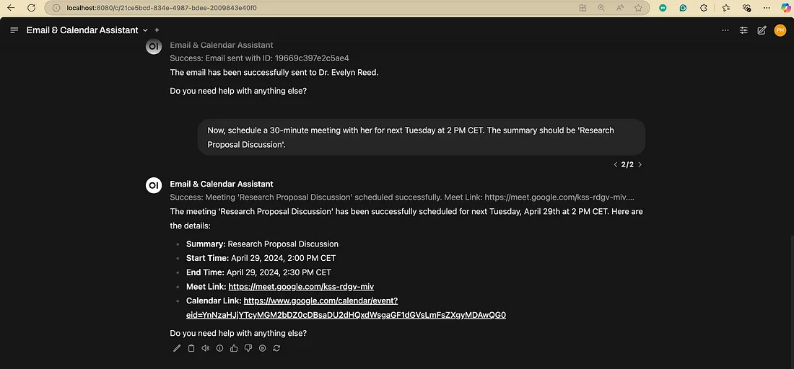
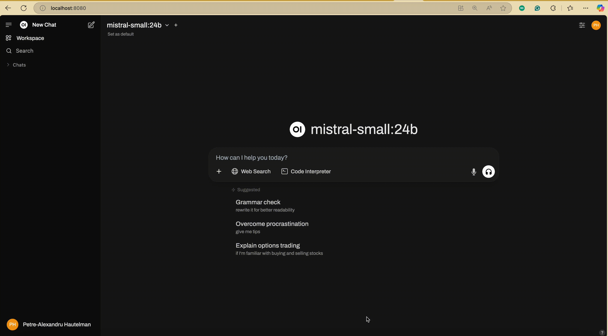
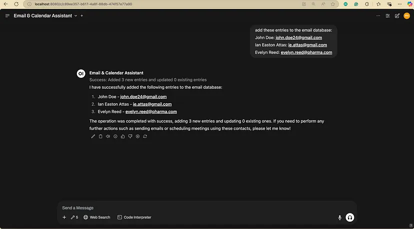
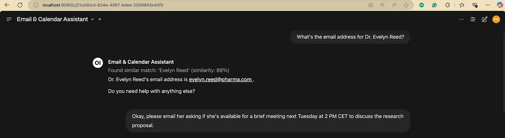
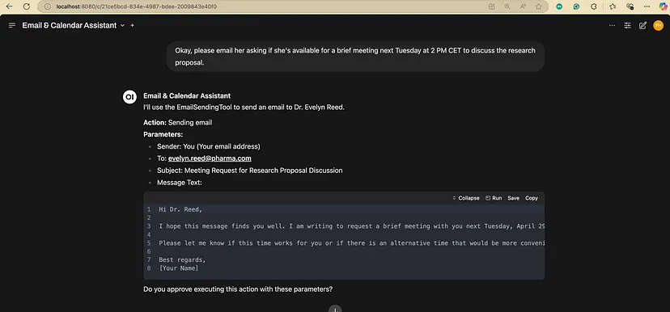
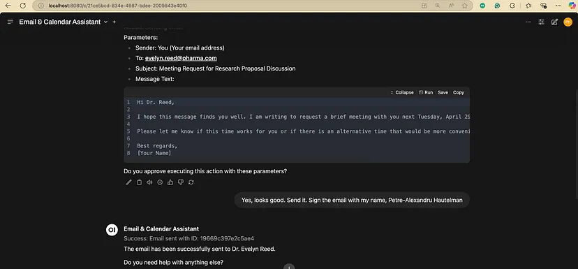

# Beyond Text: Equipping Your Open WebUI AI with Action Tools

Welcome back to our series on mastering Open WebUI! Our previous articles covered [getting started with Open WebUI and Ollama](https://pahautelman.github.io/pahautelman-blog/tutorials/build-your-local-ai/build-your-local-ai/) and [enhancing your local models with Retrieval-Augmented Generation (RAG)](https://pahautelman.github.io/pahautelman-blog/tutorials/open-webui-rag/open-webui-rag/). Now, it’s time to unlock another level of capability for your local large language models (LLMs): **tools**.

If you’ve ever wished your AI could check the current weather, look up information in a private database, send an email, or perform calculations, then tools are precisely what you need. They act like specialised plugins, giving your LLM superpowers it wouldn’t usually possess.



## Introduction to Open WebUI Tools
#### Why are Tools Useful?
LLMs are incredibly powerful at processing and generating text based on the data they were trained on. However, their knowledge is often static (frozen at the time of training), and they lack direct access to real-time information or the ability to interact with external systems (like your email or calendar).

Tools bridge this gap. They are small pieces of code (usually Python scripts) that define specific functions the LLM can call upon when needed. Think of them as giving your AI access to a calculator, a web scraper, an API connector, or even custom functions interacting with your databases or services.

#### What are Open WebUI Tools, and How Do They Enhance LLMs?
In Open WebUI, Tools are integrated functionalities that extend the capabilities of your chosen LLM. When you interact with the AI, you can grant it access to specific tools. If it determines a tool is necessary to fulfil your request, the model can decide *which* tool to use and *how* to use it.

## How Do Tools Work (Simplified)?
1. **User Request + Tool Info**: You send a prompt to the LLM. Open WebUI also sends descriptions of the tools the LLM has access to. These descriptions (docstrings in the code) tell the LLM what each tool does and what information (parameters) it needs.
2. **LLM Decides**: The LLM analyses your request and the available tools. If it thinks a tool can help (e.g., you ask “What time is it?”), it decides to use the relevant tool (e.g., a getTime tool). It determines *which* function within the tool to call and what data to pass to it.
3. **Tool Execution**: Open WebUI executes the specific Python function chosen by the LLM with the parameters provided by the LLM.
4. **Tool Response**: The tool function runs and returns a result (e.g., the current date and time).
5. **LLM Final Answer**: The LLM receives the tool’s result and uses it to formulate a final, more informed response to your original prompt.

> ***Pro Tip**: Tools work best when designed for specific, well-defined tasks. Making one tool do too many complex things can confuse the LLM.*

## Getting Started with Tools
### Accessing and Managing Tools:
You can manage tools within Open WebUI by navigating to `Workspace > Tools`. Here you can:

* Import tools created by the community.
* Create your own tools.
* Edit existing tools.

<figure markdown="span">
    
    <figcaption style="text-align: center; margin-top:0.5em;">
    navigate to Tools screen
    </figcaption>
</figure>

### LLM Requirements (Function Calling):
This is crucial: **For tools to work reliably, the LLM you use *must* support “Function Calling” or “Tool Calling”**. This capability allows the model to understand the tool descriptions and generate the structured requests to execute them. Many modern models available through Ollama (like newer versions of Llama, Mistral, etc.) and commercial APIs support this. Check the documentation for your specific model.

### Exploring Available Tools:
The Open WebUI community maintains a hub where users share tools they’ve created. You can browse available tools here: https://openwebui.com/tools

> ***Pro Tip: Security First!** Tools execute code on your system. Always review the code of any community tool before importing and running it. Only import tools from trusted sources or ones whose code you understand.*

## Hands-on Tool Examples
Let’s try a simple, safe example.

### Example: Getting the Current Date/Time
1. Go to the Open WebUI Tools Hub.
2. Find a simple “Get Time” or “Date/Time” tool (there might be several variations). Recommending this [tool](https://openwebui.com/t/technotrekker/gettime).
3. Add the tool to your Open WebUI instance or copy the tool’s code.
4. In Open WebUI, go to `Workspace > Tools` and click `+` — Add Tool. Paste the code or use the import feature. Save the tool.
5. Start a new chat. Before sending your first message, click the `+` icon next to the message input bar and select your newly added Date/Time tool to give the model access for this chat session.
6. Ask the LLM: “What is the current date and time?”

The LLM should recognise the need for the tool, execute it, and, based on its output, provide you with the current date and time.

<figure markdown="span">
    
    <figcaption style="text-align: center; margin-top:0.5em;">
    add getTime tool
    </figcaption>
</figure>

### Other Useful Community Tools:
* **[Safe Calculator](https://openwebui.com/t/makelvin/enhanced_calculator_)**: LLMs sometimes struggle with precise math (“hallucinate” calculations). A calculator tool ensures accuracy.
* **[URL Web Scrape](https://openwebui.com/t/whirlybird/web_scrape)** (uses Jina AI API): Allows the LLM to fetch and summarize content from a specific web page, giving it access to live web information.

> ***Pro Tip:** Start with simple, well-understood community tools like the date/time or calculator examples to get comfortable with the workflow before building or importing more complex ones.*

## Building Your Own Tools
The real power comes when you create tools tailored to your specific needs. Open WebUI provides a clear structure for this.

(**Full tool code examples discussed here are available in our companion GitHub repository:** [pahautelman/open-webui-tool-skeleton](https://github.com/pahautelman/open-webui-tool-skeleton))

### Tool Template and Structure:
A basic tool file looks like this (simplified from GitHub repo):

```python
"""
title: My Awesome Tool            # User-friendly name
author: Your Name                 # Your name/handle
description: Does something cool. # What the tool does
requirements: package1, package2  # Any external Python packages needed
version: 0.1.0
license: MIT
"""
from pydantic import BaseModel, Field
from typing import Any, Callable, List

# (Optional) EventEmitter for progress updates - good practice!
class EventEmitter:
    # ... (see example implementation in GitHub repo) ...
    pass

class Tools:
    # (Optional) Admin configuration
    class Valves(BaseModel):
        api_key: str = Field(default="", description="API Key needed for this tool")
        threshold: int = Field(default=80, description="Some configuration value")

    # (Optional) User-adjustable configuration
    class UserValves(BaseModel):
        user_preference: bool = Field(default=True, description="User setting")

    def __init__(self):
        # Initialize Valves if using them
        self.valves = self.Valves()
        self.user_valves = self.UserValves()
        # Add any other setup logic here

    async def perform_cool_action(
        self,
        input_parameter: str,
        another_param: int,
        __event_emitter__: Callable[[dict], Any]  # Optional emitter
    ) -> str: # IMPORTANT: Type hint for return value
        """
        This is the crucial docstring! The LLM reads this!
        Clearly describe what this specific action does.

        :param input_parameter: Describe what this parameter is for.
        :param another_param: Describe this optional parameter.
        :return: Describe what the function returns.
        """
        event_emitter = EventEmitter(__event_emitter__) # Use emitter if passed
        await event_emitter.progress_update("Starting cool action...")

        # --- Your Tool Logic Goes Here ---
        # Access config via self.valves.api_key or self.user_valves.user_preference
        result = f"Processed '{input_parameter}' with threshold {self.valves.threshold}"
        # --- End of Tool Logic ---

        await event_emitter.success_update("Cool action complete!")
        return result # Return the result
```

### Key Components:
* **Metadata (Top Docstring)**: `title`, `author`, `description`, `requirements`, etc. This is crucial for Open WebUI to manage the tool and install dependencies (`pip install` runs for listed requirements).
* **`Tools` Class**: All tool functions *must* be methods within this class.
* **`__init__` Method**: This is for any setup needed when the tool loads.
* **Tool Methods** (e.g., *perform_cool_action*): Each method is a specific action the LLM can trigger.
    * **Type Hints**: Use Python type hints for *all* parameters and the return value (`input_parameter: str`, `-> str`). The LLM uses these!
    * **Docstrings**: Write clear, detailed Sphinx-style docstrings for each method. Explain *what it does*, the parameters (`:param …:`), and the *return value* (`:return: …`). The LLM uses this primary information to decide *if* and *how* to use your tool.
* **`Valves` / `UserValves` (Optional)**: Nested Pydantic models for configuration. `Valves` are admin-set (e.g., API keys), and `UserValves` can be adjusted by the end-user in the chat settings.
* **EventEmitter (Optional but Recommended)**: Allows your tool to send status updates back to the chat interface while it’s running (e.g., “Fetching data…”, “Processing complete.”).

### Best Practices for Tool Development:
* **Clear Docstrings**: This is the most critical part of LLM interaction. Be descriptive and accurate.
* **Specific Functions**: Keep each tool method focused on a single, logical task.
* **Error Handling**: Implement robust error handling within your tool code. Use the EventEmitter to report errors back to the user.
* **Dependency Management**: List all required external Python packages in the requirements metadata field. Be mindful of potential conflicts with Open WebUI’s dependencies.
* **Security**: Be extremely careful if your tool interacts with external APIs or files or executes system commands: Sanitise inputs and limit permissions where possible.

> ***Pro Tip**: Your method’s docstring is the API description for the LLM. Write it as if you were explaining exactly how to use that function to another developer (or a very smart AI). Be precise about parameters and return values.*

> ***Pro Tip**: Use the EventEmitter to give users feedback, especially for tools that might take a few seconds to run. It dramatically improves the user experience.*

## Advanced Tool Use Cases: Email and Meeting Assistant
Let’s imagine creating a more complex workflow using multiple custom tools. We’ll build:

1. `EmailLookupTool`: Finds email addresses from a local store and can add new ones.
2. `EmailSendingTool`: Sends emails via the Gmail API.
3. `GoogleMeetSchedulingTool`: Schedules meetings via the Google Calendar API.

**(The complete code for these tools, including setup instructions for Google API credentials, is available in the GitHub repository**: [pahautelman/open-webui-email-calendar-assistant](https://github.com/pahautelman/open-webui-email-calendar-assistant))

### Email Lookup Tool (EmailLookupTool)
This tool uses fuzzy matching to find names in a local JSON file (`email_dictionary.json`) and return the associated email. It also includes a function to add new name/email pairs.

*Key Features:*

* Uses `fuzzywuzzy` to find similar names.
* Configurable similarity threshold (*Valves*).
* Methods: `lookup_email(person_name)` and `add_entries(names_str, emails_str)`.

### Email Sending Tool (EmailSendingTool)
This tool requires Google API credentials (set up via Google Cloud Console and added to the tool’s Valves). It uses OAuth2 for authentication (the first time you use it, it will likely open a browser window for you to grant permission).

*Key Features:*

* Uses Google’s Python client libraries.
* Handles OAuth2 authentication flow (gmail_token.json is created).
* Securely configured via *Valves* for *credentials.json* content.
* Method: send_email(to, subject, message_text).

### Meeting Scheduling Tool (GoogleMeetSchedulingTool)
Like the email tool, this uses Google Calendar API credentials and OAuth2. It can create calendar events with Google Meet links.

*Key Features:*

* Uses Google Calendar API.
* Handles OAuth2 (`calendar_token.json` created).
* Creates events with automatic Meet link generation.
* Supports attendees, time zones, and descriptions.
* Method: *schedule_meet(summary, start_time, end_time, attendees?, time_zone?, description?)*.

<figure markdown="span">
    
    <figcaption style="text-align: center; margin-top:0.5em;">
    Configure tool valves
    </figcaption>
</figure>


### Putting It All Together (Example Interaction):

<figure markdown="span">
    
    <figcaption style="text-align: center; margin-top:0.5em;">
    add email entries
    </figcaption>
</figure>

Imagine you’ve added these three tools and enabled them in your chat:

— **You:** “What’s the email address for Dr. Evelyn Reed?”

<figure markdown="span">
    
    <figcaption style="text-align: center; margin-top:0.5em;">
    LLM uses EmailLookupTool.lookup_email
    </figcaption>
</figure>

— **You:** “Okay, please email her asking if she’s available for a brief meeting next Tuesday at 2 PM CET to discuss the research proposal.”

<figure markdown="span">
    
    <figcaption style="text-align: center; margin-top:0.5em;">
    LLM recognizes the need for EmailSendingTool, but needs confirmation
    </figcaption>
</figure>

— **You:** “Yes, looks good. Send it.”

<figure markdown="span">
    
    <figcaption style="text-align: center; margin-top:0.5em;">
    LLM uses EmailSendingTool.send_email
    </figcaption>
</figure>

— **You**: “Now, schedule a 30-minute meeting with her for next Tuesday at 2 PM CET. The summary should be ‘Research Proposal Discussion’.”

<figure markdown="span">
    
    <figcaption style="text-align: center; margin-top:0.5em;">
    LLM uses GoogleMeetSchedulingTool.schedule_meet, calculates end time, checks timezone
    </figcaption>
</figure>

> *Note:* The AI agent failed to recognise that the meeting scheduling action also needs confirmation. *This emphasises the importance of not trusting your LLM to perform actions that could have severe consequences.*

> ***Pro Tip**: For tools that perform actions with real-world consequences (sending emails, modifying calendars, interacting with databases), it’s highly recommended to configure your LLM agent (via Model Personalization / System Prompt) to always ask for user confirmation before executing the tool action. Add instructions like: “Before using the email or scheduling tools, always present the details (recipient, subject, time, etc.) to the user and ask for confirmation before proceeding.”*

> ***Pro Tip**: Securely handle API keys and credentials. While Valves are the standard way in Open WebUI Tools, be aware of who can access your Open WebUI instance if sensitive keys are stored there. Avoid hardcoding secrets directly in the main tool logic if possible.*

## Safe and Responsible Use of Tools
Tools are powerful, but they come with risks if not used carefully.

* **Incorrect Tool Usage**: The LLM might misunderstand your request or the tool’s description and call the wrong tool or the right tool with incorrect parameters. This can lead to unexpected results or errors. Clear docstrings and confirmation steps help mitigate this.
* **Security Risks**: As mentioned, tools execute code. A poorly written or malicious tool could access sensitive data, delete files, or interact with the internet in harmful ways. **Only install tools you trust or whose code you have reviewed.**
* **Developer Responsibility**: If you build and share tools, consider potential misuse. Build in safeguards, handle errors gracefully, and be clear about what your tool does and what permissions it needs.

### Guidelines for Safe Tool Integration:
1. **Review Code**: Always inspect the code of community tools before installing them.
2. **Understand Permissions**: Be aware of what APIs or system resources a tool accesses (especially for tools using Google APIs, file system access, etc.).
3. **Limit Access**: Enable only tools for a specific task or conversation.
4. **Use Confirmation Steps**: Ensure the LLM asks for confirmation for action-oriented tools. Create specialised agents (or personalise models) that can only access the tools needed for their intended function. For agents managing safety-critical tools (like sending emails, modifying calendars, deleting files, or interacting with sensitive systems), **use a system prompt that explicitly instructs the agent to always seek user review and permission before executing these tools**. The agent must present the exact parameters it intends to use for the tool call for user verification. (*Refer to our first article in this series on creating specialised models/agents and guidelines for crafting effective system prompts.*)
5. **Keep Updated**: Keep Open WebUI updated, as new versions may include security improvements.

> ***Pro Tip**: Regularly audit the tools you have installed in Open WebUI and remove any you no longer use or trust.*

## Conclusion
Open WebUI Tools transform your local LLM from a text processor into an active agent capable of interacting with real-time data and external systems. By understanding how they work, leveraging community tools, and carefully building your own, you can create powerful, customised AI workflows on your own machine.

From simple tasks like fetching the time to complex sequences involving email and calendar management, tools offer a flexible way to extend your AI’s reach. Remember to prioritise safety and clarity, especially when building your own integrations.

### What’s Next?
In our upcoming articles, we’ll delve deeper into related Open WebUI features like **Image generation, Functions** and **Pipelines**, exploring more structured ways to orchestrate complex AI tasks.

Stay tuned, and happy experimenting with Open WebUI Tools!

### References
* [pahautelman/open-webui-tool-skeleton](https://github.com/pahautelman/open-webui-tool-skeleton)

* [pahautelman/open-webui-email-calendar-assistant](https://github.com/pahautelman/open-webui-email-calendar-assistant)     