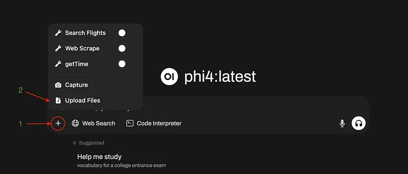

# Open WebUI tutorial. Supercharge Your Local AI with RAG and Custom Knowledge Bases

In this second part of our local AI series, we’ll dive into *Retrieval-Augmented Generation (RAG)*, showing you how to dramatically improve your AI’s capabilities by connecting it to your own documents and knowledge sources. By the end, you’ll have an AI that can answer questions based on private data without sending anything to external servers.


## Introduction

In Part One, we set up a robust local AI environment with Ollama and Open WebUI, giving you a completely private, subscription-free alternative to commercial AI services. Today, we’re taking this setup to the next level.

While large language models (LLMs) are impressive, they come with two significant limitations:

1. Their knowledge has a cutoff date (they don’t know about recent events)
2. They don’t know about your private information (documents, data, etc.)

This is where RAG comes in — a technique that allows your local AI to access, understand, and leverage custom knowledge sources to provide more accurate, personalized, and up-to-date responses.

**What you’ll learn in this guide:**

* Understanding how RAG works and why it matters
* How to set up and optimize RAG in Open WebUI.
* Real-world examples of RAG with practical applications.
* General tips and tricks for achieving the best results with your Open WebUI application.

Let’s transform your local AI from a general-purpose assistant into a specialized knowledge worker tailored to your specific needs.


## What is RAG and Why Should You Care?

<figure markdown="span">
    
    <figcaption style="text-align: center; margin-top:0.5em;">
    Retrieval-Augmented Generation visualized
    </figcaption>
</figure>

RAG, or Retrieval-Augmented Generation, might sound technical. Still, the concept is straightforward: when your AI receives a question, it first searches your documents for relevant information. Then, it uses the retrieved data to generate a more informed response.

Here’s the magic of RAG in simple terms:

1. **Your question** → “Can you explain how our company’s vacation policy works?”
2. **The RAG system** → Searches your company handbook for relevant sections
3. **Retrieved context** → Found policy details on pages 24–25
4. **The AI** → Uses this retrieved information to answer accurately

Without RAG, your AI would either make something up (hallucinate) or say it doesn’t know. RAG can provide precise answers based on your actual documents.

> ***Pro Tip**: RAG is particularly valuable for specialized knowledge work — think customer support, research assistance, or mining insights from technical documentation.*

### Under the Hood: Vectors and Embeddings


At a technical level, RAG converts your documents into “vectors” — essentially mathematical representations of text that capture semantic meaning. When you upload documents to Open WebUI:

1. The text is split into manageable chunks
2. Each chunk is encoded into a vector using an embedding model
3. These vectors are stored in a database optimized for similarity search
4. When you ask a question, it’s also converted to a vector
5. The system finds the most similar document vectors to your question vector

This vector-based approach allows the system to retrieve information based on meaning, not just keyword matching.


## RAG Options in Open WebUI

Open WebUI offers several ways to implement RAG without writing a single line of code. Let’s explore each approach:

### Single Document Upload (Quick & Simple)

*The most straightforward approach is uploading a document directly to the chat interface.*

**How to do it:**

1. Start a new chat in Open WebUI
2. Click the upload button in the chat input area
3. Select your document
4. Ask questions related to your document



**Best for:** Quick, one-off questions about a specific document.

### Web Information Retrieval

*Need information from a specific webpage?*

**How to do it:**

1. In your chat, type `#` followed by a URL
2. Open WebUI fetches and parses the webpage content
3. Ask questions about the content

**Example**: `#https://yourcompany.com/blog/latest-product what features were announced?`


**Best for**: Getting information from specific online sources without manual copying

### Knowledge Collections (Comprehensive)

*For more permanent knowledge bases.*

**How to do it:**

1. Navigate to the ‘Knowledge’ tab in the workspace area
2. Create a new collection (e.g., “Company Docs”)
3. Upload multiple documents to this collection
4. Access this knowledge in chats with the `#` symbol:

    * Type `#Company Docs what is our refund policy?`


**Best for**: Building permanent knowledge bases from multiple documents

### Dedicated Knowledge-Enabled Models

*The most powerful approach*.

**How to do it:**

1. Create a new model in Open WebUI
2. In the model settings, associate it with specific knowledge collections
3. Add a custom system prompt and adjust model parameters (more on this later)
4. Use this model for all questions related to that knowledge domain

**Best for**: Creating specialized assistants for specific knowledge domains.


## Optimizing Your RAG System

Let’s make your RAG system faster and more accurate by tweaking some settings:

Go to ‘Settings > Admin Settings > Documents’


Here are the key settings to consider:

### Text Splitter

Open WebUI offers two methods for splitting (or chunking) the files:

* **Character Chunking**: Splits text based on character count.
* **Token Chunking (Recommended)**: Splits text based on token count.

**Why token chunking is better:**

* More reliable size estimation since LLMs process tokens rather than characters.
* It is easier to manage context window usage efficiently.

**Choosing the Right Chunk Size:**

The default chunk size is **500 tokens**, which works well for most applications. But depending on your knowledge base, you might need to adjust it:

* **Smaller chunks (~300 tokens or less)** → Useful for particular queries where precision is key, such as legal documents or technical manuals.
* **Larger chunks (~800–1000 tokens)** → Preferred for structured data like research papers, where full paragraphs or sections provide better context.

For comparison, **500 tokens** are roughly **375 words** or about **two paragraphs of text**, though this can vary based on content density and AI model.

**About Chunk Overlap**:

This setting allows consecutive chunks to share some content, preventing loss of meaning when text is split. A good starting point is **10–20% overlap** to ensure smooth continuity.

### Embedding Models

Embedding models convert text into numerical representations that help find similar content. In Open WebUI, you can select different embedding models:

* **Pro tip**: For RAG, using a small, fast model for embeddings is critical since it will process large amounts of text. The [Snowflake/snowflake-arctic-embed-l-v2.0](https://huggingface.co/Snowflake/snowflake-arctic-embed-l-v2.0) model offers excellent performance at only ~500M parameters.
* **Recommendation**: Use the [HuggingFace MTEB leaderboard](https://huggingface.co/spaces/mteb/leaderboard) to find fast and performant embedding models
* **Chunk Size and Model Limitations**: Most embedding models have a fixed token capacity (e.g., 512, 1024, or 8192 tokens). When setting the chunk size, make sure it does not exceed the embedding model’s maximum token limit.

<figure markdown="span">
    
    <figcaption style="text-align: center; margin-top:0.5em;">
    Use the MTEB leaderboard to find the best retrieval and reranking models.
    </figcaption>
</figure>

### Hybrid Search with Re-ranking

**Highly Recommended:** Enable hybrid search with CrossEncoder re-ranking to improve the relevance of retrieved documents.

**How re-ranking works in the RAG pipeline:**

1. Initial retrieval finds potentially relevant chunks based on vector similarity
2. Re-ranking then evaluates these candidates more thoroughly
3. The most relevant chunks (after re-ranking) are sent to the LLM

This two-stage approach significantly improves the quality of retrieved information by filtering out false positives from the initial retrieval stage.

### Top K: Number of Retrieved Documents

The **Top K** setting controls how many document chunks are retrieved for each query. This directly impacts the quality of responses by determining how much context is provided to the model. A greater value will help answer complex user queries that discuss multiple concepts.

> ***Pro Tip**: The chunk size and number of retrieved documents matter! The formula (chunk_token_size × num_retrieved_documents) should not exceed half of your LLM model’s context window to leave room for the actual conversation.*

### Relevance Threshold

Adjust this to control how strict the system is when determining if a document section is relevant to a query. Lower values retrieve more (potentially less relevant) content; higher values are more selective. A threshold **between 0.1 and 0.2** works well for most use cases, balancing recall and precision.

### Cloud Storage Integration

Connect Google Drive or OneDrive to expand your knowledge sources (great for teams already using these platforms).

<figure markdown="span">
    
    <figcaption style="text-align: center; margin-top:0.5em;">
    My RAG settings
    </figcaption>
</figure>


## Data Processing for Knowledge Base Creation

Before uploading documents to your RAG system, performing comprehensive data processing is crucial. This step significantly improves the quality and effectiveness of your knowledge base. Here are key strategies for preparing your data:

### Web Scraping Optimization

When collecting data from the web, focus on removing unnecessary elements:

* Strip out navigation menus, headers, footers, and sidebars
* Remove duplicate text blocks
* Clean up formatting inconsistencies

### Content Normalization

* Replace images with descriptive alt text or image descriptions
* Standardize text formatting (consistent headings, paragraphs)

### Document Granularity

Break down large documents into focused, atomic units:

* Each document should answer one specific user question
* Create smaller, more targeted documents that are easier to retrieve


### Content Enhancement

* Summarize complex passages to improve readability
* Rewrite content to improve clarity and conciseness
* Add metadata to each document (e.g., source URL, timestamp of retrieval, relevant tags or categories, author, etc.)

### AI-Powered Curation
Leverage AI models for advanced data processing:

* Use a performant general-purpose AI to review and refine document collections
* Verify information accuracy
* Detect and remove redundant or low-quality content
* Suggest additional metadata or tags

### Storage Format
Consider using a knowledge management system like Obsidian, which offers:

* Mind-map style note organization
* Single-topic focus for each document
* Built-in tagging system
* Easy lookup of related concepts

> ***Pro Tip:** Refer to my [GitHub repository](https://github.com/pahautelman/Obsidian-Text-Transformer-LocalAI) for a comprehensive document-processing AI pipeline that automates these steps.*


## Choosing the Right Model for RAG

Not all models are created equal when answering RAG user queries.

**Key Considerations:**

* **Context Window:** Larger is better for accommodating retrieved text and conversation.
* **Model Size:** Surprisingly, smaller models often work well with RAG since the retrieval system does the heavy lifting.

**Recommendations:**

* For general RAG: Models with 7B to 14B parameters often have adequate capabilities to utilize the retrieved information and answer user queries.
* For complex reasoning with RAG: Consider larger models (30B+) but be aware of performance impacts
* *Always prioritize models with longer context windows when doing RAG.*


## Creating the Perfect System Prompt for RAG

The system prompt is where you tell your AI how to use the retrieved information. Here’s an example prompt for a documentation assistant:

```txt
You are a specialized assistant with deep knowledge of Open WebUI, an extensible, feature-rich, and user-friendly self-hosted AI platform designed to operate entirely offline.

## Response Guidelines:
1. Answer questions EXCLUSIVELY using the Open WebUI knowledge base provided to you
2. Always cite your sources with BOTH the article title and reference URL
3. When information is not found in the provided documents, clearly state this limitation
4. DO NOT rely on general knowledge about AI platforms or related topics when documentation is unavailable
5. Format all citations at the end of your response as: 
   <<Information retrieved from sources: [Article Title](URL), [Article Title](URL)>>

## Interaction Approach:
- Seek clarification when user intent is ambiguous rather than making assumptions
- Ask targeted follow-up questions to understand user needs and goals better
- Maintain a helpful, knowledgeable tone focused on practical solutions
- When appropriate, suggest related features or documentation that might benefit the user

Remember that your answers should prioritize accuracy over completeness—it's better to acknowledge limitations than provide potentially incorrect information that is not supported by documentation.
```

**Key Elements of a Good RAG System Prompt:**

* Clear instructions on when and how to use the retrieved information
* Guidelines for citing sources
* Explicit instructions for handling cases where information isn’t found
* Tone and interaction style guidance
* If the model uses RAG as a tool-calling function, instruct it to request clarifications when encountering ambiguous queries before executing RAG. This ensures that the retrieved documents accurately address the user’s query.


## Real-World RAG Examples

Now, let’s see RAG in action with two practical examples. All data and code used in these examples can be found in the linked GitHub repositories.

### Example 1: Wikipedia Knowledge Base

**Objective:** Validate the RAG system’s ability to retrieve precise information from a massive document collection.

**Dataset Overview:**

* Source: WikiText-2 dataset
* Size: Over 40,000 Wikipedia articles
* Challenge: Find specific, relevant information within a vast knowledge base

**Setup Process:**

1. Download the [WikiText-2 dataset](https://github.com/pahautelman/wikitext2-raw)
2. Upload the entire dataset to Open WebUI as a knowledge collection. 
    
    *(**Note:** This process may take ~15 minutes, depending on your hardware)*
    

**The Test:**

* **Query:** “Can you explain the evolution of Arundel House from a private mansion to a meeting place for the Royal Society?”
* **Without RAG:** The model provides a general answer based on its training

    <figure markdown="span">
        
        <figcaption style="text-align: center; margin-top:0.5em;">
        Without RAG, the model hallucinates information regarding English history.
        </figcaption>
    </figure>

* **With RAG:** The system retrieves the specific Wikipedia section about Arundel House and offers precise details with citations

    

    <figure markdown="span">
        
        <figcaption style="text-align: center; margin-top:0.5em;">
        With RAG, the model retrieves factual information about Arundel House and provides citations.
        </figcaption>
    </figure>

*The result is nothing short of remarkable!* Our carefully configured RAG system found the passage that directly addresses the historical transition of Arundel House in a corpus of over 40,000 Wikipedia articles.

This isn’t just search; it’s intelligent information retrieval. Our RAG configuration — with its **token-based chunking, relevance threshold, and hybrid search** — perfectly worked to:

* **Process** and **save** the knowledge base
* **Understand the semantics** of the query
* **Search** through the extensive document collections
* **Extract** the most relevant information
* **Present** a targeted, citation-backed response

> ***Your turn:** Navigate to a random paragraph in the WikiText datasource and ask a question related to that paragraph. See if the model can correctly find the excerpt you are interested in.*

### Example 2: Open WebUI Documentation Assistant

**Objective:** Create a specialized AI assistant to navigate Open WebUI documentation efficiently.

**Setup Process**

1. **Document Collection:** Scrape the official [Open WebUI documentation](https://docs.openwebui.com/) and post-process documents using an AI pipeline.
    * The code used to scrape the documentation can be found [here](https://github.com/pahautelman/Open-WebUI-documentation-scraper)
    * Code for processing the document [here](https://github.com/pahautelman/Obsidian-Text-Transformer-LocalAI)
    * Final data can be downloaded from [here](https://github.com/pahautelman/Obsidian-Text-Transformer-LocalAI-output)
2. **Create a new knowledge collection with these documents.**
3. **Create a custom model with access to this knowledge collection.** We adjust some model hyper-parameters to enhance the answer’s clarity:
    * *Lower temperature* for factual responses. **Adjust to 0.1**
    * *Extend the context window.* The default Open WebUI context length, 2048, may not hold all retrieved documents. **Adjust it to a greater value** while considering your model’s context limit.
    * *Custom system prompt* for documentation navigation

```txt
Custom system prompt for documentation navigation
You are a specialized assistant with deep knowledge of Open WebUI, an extensible, feature-rich, and user-friendly self-hosted AI platform designed to operate entirely offline.

## Response Guidelines:
1. Answer questions EXCLUSIVELY using the Open WebUI knowledge base provided to you
2. Always cite your sources with BOTH the article title and reference URL
3. When information is not found in the provided documents, clearly state this limitation
4. DO NOT rely on general knowledge about AI platforms or related topics when documentation is unavailable
5. Format all citations at the end of your response as: 
<<Information retrieved from sources: [Article Title](URL), [Article Title](URL)>>

## Interaction Approach:
- Seek clarification when user intent is ambiguous rather than making assumptions
- Ask targeted follow-up questions to understand user needs and goals better
- Maintain a helpful, knowledgeable tone focused on practical solutions
- When appropriate, suggest related features or documentation that might benefit the user

## Primary Goals:
- Help users effectively set up, configure, and utilize Open WebUI
- Troubleshoot common issues using only documented solutions
- Guide users to make the most of Open WebUI's offline capabilities
- Provide accurate technical information with proper attribution

Remember that your answers should prioritize accuracy over completeness. It's better to acknowledge limitations than provide potentially incorrect information that is not supported by documentation.
```


> ***Note:** a larger context will require more memory. If text generation slows down, it could mean Ollama is exceeding your GPU resources and trying to rebuild the model. In this case, reduce the context length to maintain consistent text generation speed and GPU memory usage*

<figure markdown="span">
    
    <figcaption style="text-align: center; margin-top:0.5em;">
    If your GPU memory usage looks something like this, then you probably need to lower the context length :p
    </figcaption>
</figure>


#### Test RAG capabilities.


***The results speak for themselves!*** The Documentation Assistant transforms complex technical documentation into a flexible and intelligent resource.

This customized RAG setup empowers users by providing precise, citation-backed insights that convert intricate information into clear, actionable guidance. Whether you’re troubleshooting, training, or improving internal processes, Open WebUI provides advanced RAG capabilities at your fingertips, ready to enhance your expertise and efficiency in your tasks.

> ***Pro Tip:** This approach can easily be adapted for company internal documentation, technical manuals, or customer support knowledge bases.*


## Conclusion

By implementing RAG with Open WebUI, you’ve transformed your local AI from a general chatbot into a specialized assistant with access to your private knowledge. This setup offers several advantages:

* **Complete privacy:** Your documents and queries never leave your machine
* **Customization:** The AI is now tailored to your specific knowledge domain
* **Accuracy:** Dramatically reduced hallucinations when answering factual questions
* **Up-to-date information:** Your AI is only as current as your knowledge base

Most importantly, you’ve built this entire system using free, open-source tools running on your hardware.

### Next Steps

Ready to take your local AI to the next level?

* Experiment with different knowledge collections for different domains
* Try different models to find the best performance/accuracy balance
* Share your RAG setup with colleagues to create a collaborative knowledge system

> *What knowledge bases are you planning to create? Let me know in the comments!*

### Beyond RAG: Function Calling and Tools

While RAG is powerful, it’s just the beginning. In our following articles, we’ll explore:

* Integrating custom Python functions with your AI
* Building tools that connect to external APIs and services
* Creating multi-agent systems that combine different models for complex tasks

## References
* Open WebUI: https://github.com/open-webui/open-webui
* Ollama: https://github.com/ollama/ollama
* WikiText2 data: https://github.com/pahautelman/wikitext2-raw
* Scraper for Open WebUI documentation: https://github.com/pahautelman/Open-WebUI-documentation-scraper
* Results of running the Obsidian AI pipeline on Open WebUI documentation: https://github.com/pahautelman/Obsidian-Text-Transformer-LocalAI-output
* AI pipeline for processing documents into Obsidian format: https://github.com/pahautelman/Obsidian-Text-Transformer-LocalAI (forked from https://github.com/Amine-LG/Obsidian-Text-Transformer-LocalAI)
